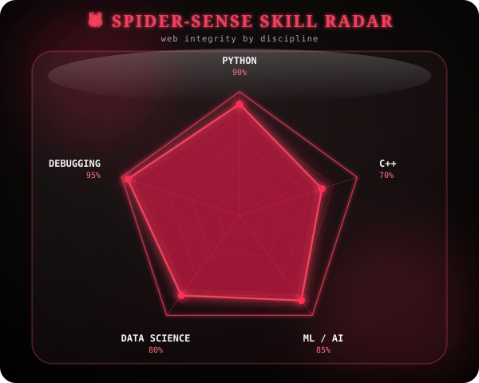

  
  # Hi there, I'm Abdul Rehman! 👋
  
  ### 🚀 Student Developer | 🤖 ML & AI Enthusiast

  *Welcome to my digital workspace! I'm currently exploring the fascinating intersections of data, algorithms, and artificial intelligence.*

  

---

### 👨‍💻 About Me

- 🎓 I'm a student actively learning and building projects in **Machine Learning** and **Artificial Intelligence**.
- 💡 I love turning data into actionable insights and experimenting with neural networks.
- 🌱 Currently deep-diving into **Data Science** libraries and algorithmic optimization.
- 🤝 I'm open to collaborating on open-source ML projects or hackathons.
- 📫 How to reach me: **[Insert your email or LinkedIn link here]**

---

### 🛠️ Tech Stack & Tools

  
  #### Core Languages
  
  

  #### Machine Learning & Data Science
  
  
  

  #### Tools & Environment
  
  
  

---

### 📈 GitHub Stats

  
  

---

## 🕸️ Spider-Web Radar (Spider-Sense Analytics)

  

| Signal Node | Power Level |
|---|---:|
| 🤖 ML/AI | 88 |
| 🐍 Python | 92 |
| 📊 Data Science | 84 |
| ⚙️ C++ | 76 |
| 🌍 Open Source | 70 |
| 🧩 Problem Solving | 90 |

> _“The web never lies — it only reveals where to swing next.”_

  <i>Thanks for stopping by! Let's connect and build something awesome together.</i>

