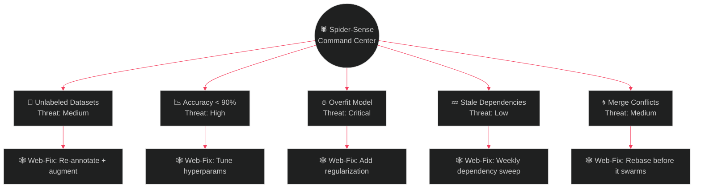

<div align="center">


<br/>


</div>

<br/>

## 🕸️ Case File: Secret Identity

```yaml
Alter Ego:     Abdul Rehman
Codename:      The Web-Slinger of Machine Learning
Base of Ops:   University Campus, Sector ML/AI
Mission:       Build intelligent systems that solve real-world problems
Weapon Belt:   Python, C++, ML pipelines, and way too much coffee
Status:        🟢 Patrolling GitHub — spider-sense active
```

- 🧠 Training in: **Machine Learning, AI, Data Science**
- 🕷️ Spins ideas into working code with **Python** and **C++**
- 🔬 Runs field experiments on data, model tuning, and optimization
- 🤝 Open to: **Open Source**, **Hackathons**, **AI Collaborations**
- 🚨 Signal the Spider-Symbol: **[Add your email / LinkedIn here]**

<br/>

## 🕸️ Spider-Sense Bug Radar

> *Every uncaught exception sets off a tremor somewhere on the web. Here's what's rattling the strands right now.*



<div align="center">

| Threat Level | Signal | Response Time |
|:---:|:---:|:---:|
| 🟢 Low | Spider-sense at rest | Whenever |
| 🟡 Medium | Faint tingle | Same day |
| 🔴 Critical | Full web-shooter deploy | **Immediately** |

</div>

<div align="center">
  <br/>
  
  <br/>
  <sub>Hand-built SVG radar — no external service, lives at <code>assets/spider-radar.svg</code>, edit the numbers directly to update it.</sub>
</div>

<br/>

## 🛠️ Utility Belt (Tech Stack)

<div align="center">

**Core Web-Shooters**


**AI / ML Web Fluid**


**Field Gear**


</div>

<br/>

## 🕸️ Web-Fluid Power Levels

<div align="center">

`Python     ` 
`C++        ` 
`ML / AI    ` 
`Data Sci   ` 
`Debugging  ` 

</div>

<br/>

## 🕷️ Web of Stats

<div align="center">
  
  
</div>

<div align="center">
  
</div>

<br/>

## 🕸️ Spider-Verse Activity Graph

<div align="center">
  
</div>

<br/>

## 🐍 The Symbiote (Contribution Snake)

<div align="center">
  

  <sub>*Rendered nightly by `.github/workflows/snake.yml` in this repo — eats your real contribution graph, red/black symbiote palette baked in.*</sub>
</div>

<br/>

## 📰 Daily Bugle — Field Report

<details open>
<summary><b>🗞️ TODAY'S HEADLINE: Local Dev Refuses to Ship Undocumented Code</b></summary>
<br/>

```diff
+ [09:00] Web-slung into the repo. Spider-sense calm.
+ [11:20] Caught a bug mid-swing before it hit production.
! [14:45] Villain sighted: NullPointerException. Neutralized.
+ [17:30] Refactor complete. Web held strong under load testing.
- [22:00] One TODO left unresolved. The chase continues tomorrow.
```

</details>

<details>
<summary><b>🕵️ Rogues Gallery — Bugs Defeated This Month</b></summary>
<br/>

| Villain | Alias | Status |
|---|---|---|
| 🟥 Green Goblin | `IndexError` | Captured |
| 🟦 Doctor Octopus | `Memory Leak` | Captured |
| 🟨 Sandman | `Flaky Test` | Escaped — still at large |
| ⚫ Venom | `Merge Conflict` | Captured |

</details>

<br/>

## 🧪 Daily Mission Board

- [ ] Train and compare 2 new ML models
- [ ] Push 1 meaningful commit daily
- [ ] Contribute to 1 open-source issue weekly
- [ ] Build 1 mini AI project per month
- [ ] Keep code quality > chaos level 🕷️

<br/>

## 🏆 Trophy Wall

<div align="center">
  
</div>

<br/>

## 🕶️ Fun Zone — Spider Signals

<div align="center">

```diff
+ Spider-Sense: Tingling when model accuracy drops below 90%
# Weakness: Unlabeled datasets
! Power-Up: Coffee + Lo-fi + Midnight coding
* Catchphrase: "It's not a bug, it's a plot twist."
```

</div>

<br/>

## 📡 Signal the Spider-Symbol

<div align="center">
  <a href="https://www.linkedin.com/in/your-linkedin/"></a>
  <a href="mailto:yourmail@example.com"></a>
</div>

<br/>

<div align="center">
  <h3>🕷️ "In this repo, no bug escapes the web."</h3>
  
</div>
